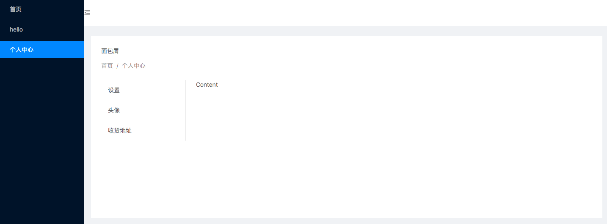

# vue-router-paths

扩展meta对象，支持一些常用功能

* 面包屑，当前路径
* 子菜单数据获取

## 使用

```js
import watchRouterPaths from 'vue-router-paths'

const router = new VueRouter({
  mode: 'history',
  base: '/',
  routes: [{
      path: '/',
      component: Hello,
      meta: {
        title: '首页',
    },
    children: [
      {
        path: '/profile',
        component: Profile,
        meta: {
          title: '个人中心'
        },
        children: [
          {path:'setting', meta:{title:'设置'}},
          {path:'avatar', meta:{title:'头像'}},
          {path:'address', meta:{title:'收货地址'}},
        ]
      },
    ]
    }, // No props, no nothing
    {
      path: '/hello/a',
      component: Hello,
      props: true,
      meta: {
        title: 'hello'
      },
      children: [{
        path: '/hello/sub/:name',
        component: Hello,
        props: true,
        meta: {
          title: 'hello2'
        }
      }]
    },
    {
      path:'/user',
      redirect:'/profile',
      meta: {
        title: '个人中心'
      },
    },
  ]
})
watchRouterPaths(router)
```



## router.routes

router.routes =  router.options.routes

## meta 对象

* @param {string} index 当前数组索引
* @param {bool} display true 显示 false 不显示 默认不显示
* @param {string} fullPath 路由路径
* @param {string} key 组建循环key，唯一，不需要关心
* @param {string} level 层级
* @param {string} icon 图标

1. 获取当前路径

```js
this.$route.meta.paths
```

2. 获取当前路路径当前组件的router-view层级

```js
// this 当前组件
this.$vnode.data.routerViewDepth
```

3. 获取当前组件的子菜单， 当前组件必须是由router-view渲染

```js
this.$route.meta.paths[this.$vnode.data.routerViewDepth].children
```

4. 判断当前组件是否 router-view 渲染
```js
this.$vnode.data.routerView // true 是
```

## examples

1. ant-design-vue

```
cd examples/ant-design-vue-demo
npm i
vue serve main.js
```